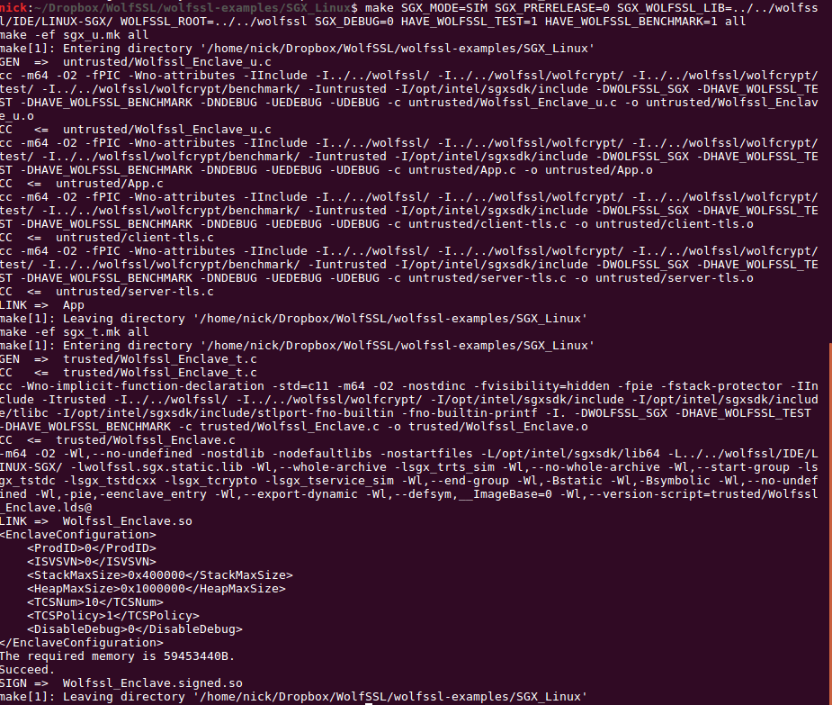

# Web Proxy Linux Enclave

## Build
For make the user should specify:
1. Specify SGX Mode. This can be either SIM or HW

	`SGX_MODE=[SIM,HW]`

2. Whether SGX should be built as Prerelease or regular release

    `SGX_PRERELEASE=[1,0]`

3. Specify if SGX Debug should be set. (This also controls whether wolfssl debug prints, if it was enabled at compile-time for the static library).

    `SGX_DEBUG=[1,0]`

4. The location of the prebuilt static library (this will probably point to `<wolfssl-root>/IDE/LINUX-SGX`)

    `SGX_WOLFSSL_LIB=[location/to/libwolfssl.sgx.static.a]`

5. The location of wolfssl root directory for the header files.

    `WOLFSSL_ROOT=[location/to/wolfssl_root]`

### Expected Output

## Running
After building, the user can specify one of a set of options to be run via the command line. These are:

* -s: Run the web proxy server in an enclave on port 8080.
* -u: Run a TLS Client in the untrusted world that will attempt to connect to a website using WolfSSL library.